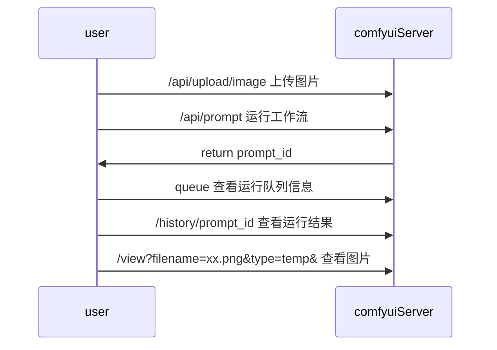

## 产品
一个包装comfyui工作流 ，提供在线运行comfyui工作流的网站应用
[online comfyui server](https://comfyui.fkyang.com/)

### 服务架构

### 项目模块介绍
- react_front：react前端项目
- comfyui：后端java多模块项目
  - comfyui_common：通用类
  - comfyui_dao：db访问模块
  - comfyui_service：服务模块
  - comfyui_web：web启动模

### 依赖能力

#### github图片存储
作用：将图片信息存储到github中，提供在线的访问能力
github api官方文档：https://docs.github.com/en/rest/repos/contents?apiVersion=2022-11-28#create-or-update-file-contents
参考文档：https://blog.csdn.net/weixin_46522803/article/details/126052265

#### Comfyui服务

接口参数来源
1. 浏览器f12，查看每次提交后的http请求
2. 看代码，根目录下的 server.py 